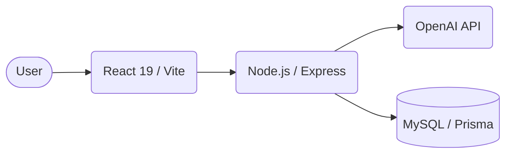

# 🤖 Gestionnaire Intelligent de CV & Lettres de Motivation avec IA

[](https://github.com/tawfiq154/-Gestionnaire-Intelligent-de-CV-et-Lettres-de-Motivation-avec-IA-main/actions)
[](https://opensource.org/licenses/MIT)
[](http://makeapullrequest.com)

---

> [!NOTE]  
> **Premium Full-Stack SaaS Application** specializing in AI-driven career documents. Automatically generate ATS-compliant CVs and compelling cover letters in seconds using OpenAI.

---

## 📸 Overview / Aperçu

---

## ✨ Features / Fonctionnalités

<table style="width:100%">
  <tr>
    <th width="50%">English 🇬🇧</th>
    <th width="50%">Français 🇫🇷</th>
  </tr>
  <tr>
    <td><b>AI CV Architect:</b> Structured Markdown CVs with multiple templates (Modern, Classic).</td>
    <td><b>Générateur de CV par IA :</b> CV structurés en Markdown avec plusieurs templates.</td>
  </tr>
  <tr>
    <td><b>Tailored Cover Letters:</b> Adaptive AI specialized according to the company and role.</td>
    <td><b>Lettres de Motivation :</b> Adaptation automatique selon l'entreprise et le poste.</td>
  </tr>
  <tr>
    <td><b>Premium Design System:</b> Glassmorphism, fluid animations (Plus Jakarta Sans).</td>
    <td><b>Design System Premium :</b> Glassmorphism, animations fluides et typographie moderne.</td>
  </tr>
  <tr>
    <td><b>Full Tracking & Security:</b> Token usage history and JWT Authentication.</td>
    <td><b>Authentification & Suivi :</b> Historique complet et sécurité via JWT.</td>
  </tr>
</table>

---

## 🛠️ Tech Stack / Architecture



| Component | Technologies |
|------|-------------|
| **Backend** | Node.js 20+, Express, Prisma, MySQL 8 |
| **Frontend** | React 19, Vite, Axios, Lucide Icons |
| **Intelligence** | OpenAI (GPT-4o / GPT-3.5) |
| **Design** | Vanilla CSS (Premium Custom Tokens) |

---

## 🚀 Installation & Setup

### 1. Requirements / Prérequis
- Node.js > 20.0
- Docker Desktop
- OpenAI API Key

### 2. Backend Setup
```bash
cd backend
npm install
# Configure your .env (OPENAI_API_KEY, DATABASE_URL)
docker-compose up -d
npx prisma migrate dev --name init_premium
npm run dev
```

### 3. Frontend Setup
```bash
cd ../frontend
npm install
npm run dev
```

---

## 📋 Available Scripts / Scripts Disponibles

| Command | Folder | Description |
|----------|--------|-------------|
| `npm run dev` | /backend | Starts API server |
| `npm run dev` | /frontend | Starts React dev server |
| `npm run db:migrate` | /backend | Sync schema with DB |
| `npm run build` | /frontend | Production build |

---

## 🛡️ Security / Sécurité
- **JWT Authentication** for secure access to profiles.
- **Inputs Validation** with `express-validator`.
- **Bcryptjs** for safe password hashing.

---

Developed with ❤️ .
